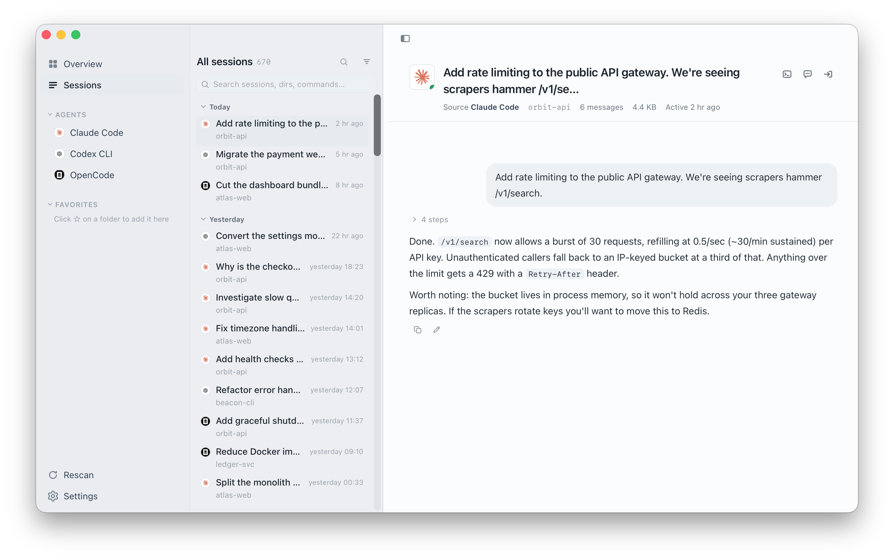
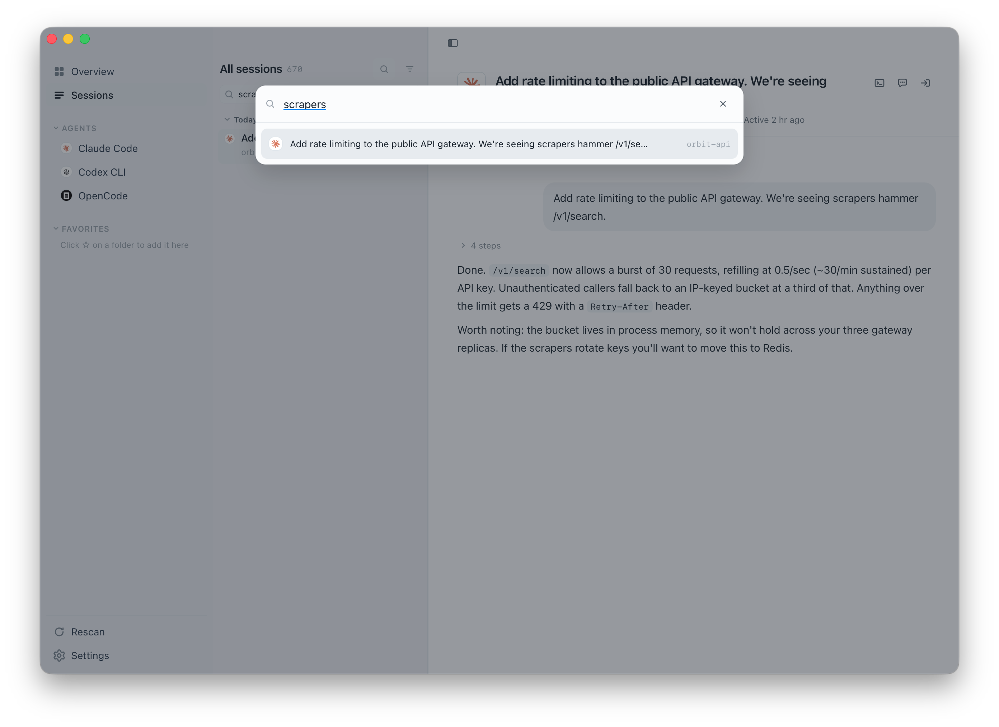
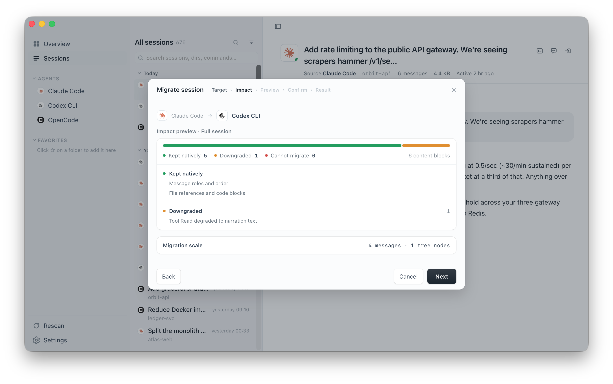
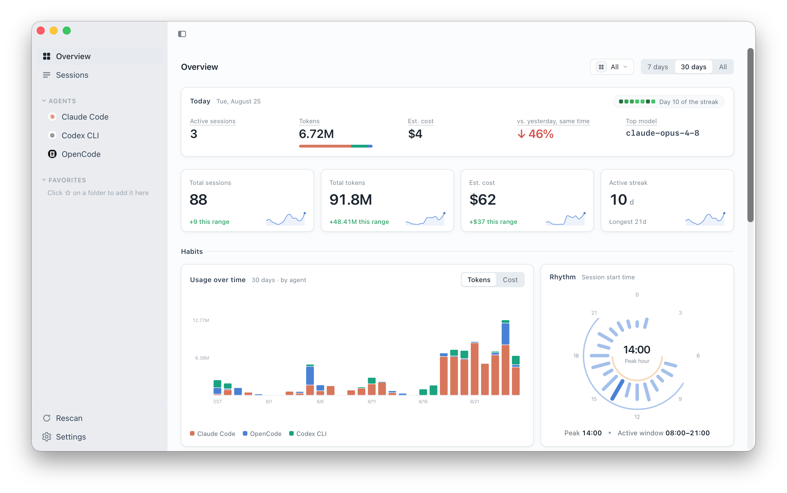
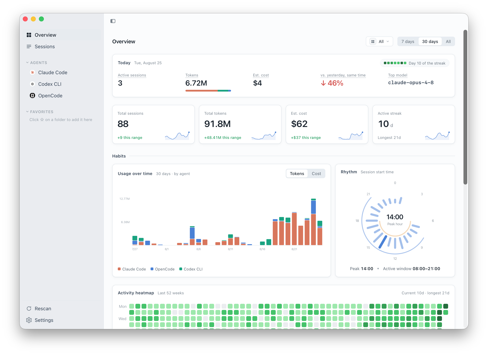

<h4 align="right"><a href="./README.md">简体中文</a> | <strong>English</strong></h4>

<h1 align="center">
  
  <br>
  Ferry
</h1>

<p align="center">
  <strong>Unify, search, and migrate your coding agent sessions — and hand that history back to the agents themselves.</strong>
</p>

<p align="center">
  Ferry brings together the conversation history of Claude Code, Codex CLI, OpenCode,
  Pi Agent, Grok Build, and Cursor into a single library.
  Browse thousands of sessions, migrate context between agents with an impact preview,
  understand your token usage — and, through the <code>ferry</code> CLI and its bundled
  skills, let any coding agent search, resume, and audit that history.
  Privacy-first, no account required, nothing leaves your machine.
</p>

<p align="center">
  <a href="https://github.com/kzheart/ferry/releases"></a>
  
  <a href="#download"></a>
  <a href="#download"></a>
  <a href="./LICENSE"></a>
  
</p>

<div align="center">
  
</div>

---

## Table of Contents

- [Why Ferry](#why-ferry)
- [Supported Agents](#supported-agents)
- [Features](#features)
  - [Unified Session Library](#unified-session-library)
  - [Cross-Agent Migration](#cross-agent-migration)
  - [Resume in Another Agent](#resume-in-another-agent)
  - [Use Ferry from Your Coding Agent (CLI + Skill)](#use-ferry-from-your-coding-agent-cli--skill)
  - [Usage Analytics](#usage-analytics)
  - [Session Editing](#session-editing)
- [Download](#download)
- [Development](#development)
- [Architecture](#architecture)
- [License](#license)

## Why Ferry

Coding agents keep their sessions in private stores — `~/.claude`, `~/.codex`,
OpenCode's local database, Cursor's `state.vscdb`. They can't see each other's
history, browsing them means digging through JSONL files by hand, and the agents
themselves have no idea how you solved the same problem last week.

Ferry solves four problems:

- **Unified library** — All agent sessions side by side, searchable by title, directory, or command, with tool calls, reasoning summaries, and session trees rendered in a single consistent view.
- **Cross-agent migration** — Move a conversation between agents with a migration impact preview upfront: see what maps natively, what gets downgraded, and what can't come along. Source sessions are never modified.
- **Agents that use their own history** — One `ferry` command and two skills let Claude Code, Codex, or any other agent full-text search past sessions, pick up another session and keep working, and audit what a different agent actually did.
- **Usage stats** — Year-round activity view, cost by model and project, and migration summaries.

## Supported Agents

| Agent | Browse Sessions | Cross-Agent Migration | Resume (ferry-resume) |
| --- | :---: | :---: | :---: |
| Claude Code | ✓ | ✓ | ✓ |
| Codex CLI | ✓ | ✓ | ✓ |
| OpenCode | ✓ | ✓ | ✓ |
| Pi Agent | ✓ | ✓ | ✓ |
| Grok Build | ✓ | ✓ | ✓ |
| Cursor | ✓ | out ✓ / in — | ✓ |

Cursor can be a migration **source** (move a Cursor chat into another agent), but
Ferry no longer migrates **into** Cursor. To continue a conversation inside Cursor,
use **Resume** (`ferry-resume`) instead.

## Features

### Unified Session Library

Browse every session from every agent in a single, consistent interface. Sessions are
grouped by recency and tagged with their source agent.

- **Search**: Hit `⌘K` on macOS or `Ctrl+K` on Windows to jump to any session by title, directory, or command.
- **Filter**: Narrow by source agent, time range, or project directory.
- **Scale**: Designed for large libraries — thousands of sessions stay responsive under click, scroll, and filter.
- **Session tree**: Full conversation topology — including subagent dialogues — with inline image preview.
- **Local metadata**: Rename, tag, and pin sessions without touching the originals. Deletions are backed up and undoable.

<div align="center">
  
</div>

### Cross-Agent Migration

Move a conversation from one agent to another. Every agent stores sessions differently,
so migration is rarely lossless. Ferry shows you exactly what the cost is — _before_
anything is written.

- **Impact preview** — See what maps natively, what gets downgraded, and what drops, before you commit.
- **Native output** — Sessions are written in the target agent's own format.
- **Resume command** — Ferry hands back a terminal command to continue the conversation immediately.
- **Traceable origin** — Migrated sessions are labeled with the agent they came from, right in the session detail.

<div align="center">
  
</div>

### Resume in Another Agent

Native migration is high-fidelity but has preconditions (the target format must be
writable and support being migrated into). **Resume** is the path that always works: nothing is
written to any store — the receiving agent reads the history itself, writes a summary,
checks the repository, and carries on.

1. Right-click a session in Ferry → **Copy resume instruction**. You get one line:
   `/ferry-resume <agent> <session id>`.
2. Paste it into any coding agent that has the `ferry-resume` skill.
3. It reads the history through Ferry, writes a takeover summary (goal, done, open,
   stopping point), checks the repository state, and continues.

The target can be the **same agent**: resuming a Claude Code session into a fresh
Claude Code session is just continuing with a clean context. When a migration is
refused (for example when the target does not support being migrated into), Ferry offers this instruction as the
fallback.

### Use Ferry from Your Coding Agent (CLI + Skill)

**Install**: Settings → **Agent integration** → one click installs the `ferry` command
and its companion skills. No sudo required, and the command keeps working when the desktop
app isn't running.

The `ferry` command lets agents search, read in pages, migrate sessions, and check usage;
the skill teaches them when to use it, how to read, and what needs your approval first
(for example, confirming the impact summary before a migration writes anything). Once
installed, you can just say:

| Scenario | What you say to the agent | What happens |
| --- | --- | --- |
| **How did we fix this last time** | "How did we fix the Playwright timeout before? Look through past sessions." | Full-text search across agents and projects, locate the relevant messages, read them in pages, cite session title and date — and say so if nothing matches, never invent |
| **Pseudo-infinite context** | When context is nearly full, open a new session and paste `/ferry-resume claude <id>` | The new session reads from the tail of the old one, writes a takeover summary, verifies the repo, then continues — not compression, a clean context picking up the work |
| **Cross-agent relay** | Plan in Claude Code, then paste the resume instruction into Codex: "continue this session and implement the plan" | The receiver only reads history and touches no store; also the fallback when native migration isn't possible |
| **Audit another agent** | "Check what Codex just changed in this project and whether anything looks wrong" | Rebuild the timeline: user intent → tool calls → results → what changed on disk |
| **Mine reusable workflows** | "Go through the last two weeks of sessions, find what I keep asking you to do and the traps we keep hitting, and turn them into a skill or CLAUDE.md rules" | List sessions by project and time window, read cheaply, distill recurring patterns and failure modes |
| **Weekly report / retro** | "Summarize this project's sessions from the last 7 days: what was tried, what landed, what's unresolved" | List sessions by project and time window, roll up by theme, read deeply only into the sessions that matter |
| **Onboard a new machine or teammate** | "Read this project's session history and write an onboarding note / a first CLAUDE.md" | Extract architecture decisions, conventions, and pitfalls from history into a project memory file |

### Usage Analytics

Understand your coding-agent habits over time:

- **Overview dashboard** — Total sessions, tokens consumed, estimated cost, and current streak.
- **Model breakdown** — Which models you've gravitated toward month over month.
- **Project breakdown** — Cost per project at a glance.
- **Activity heatmap** — A 52-week view of your daily coding activity.

<div align="center">
  
</div>

<div align="center">
  
</div>

### Session Editing

Modify conversations before you resume them:

- **Delete turns** — Remove individual conversation rounds.
- **Rewrite messages** — Edit user prompts and AI responses in place.
- **Replace assistant replies** — Replace an assistant reply, including its
  ordered tool calls, through the same edit operation lifecycle.
- **Safe by design** — Every change is previewed as a diff and backed up before application. Sessions can always be rolled back.

### More

- Auto-detects installed agents and local session data on startup
- Native macOS menu bar and sidebar vibrancy materials, following the system light/dark theme
- When an update is available, an update button appears in the sidebar: one click downloads, installs, and restarts; after restart Ferry shows what changed

## Download

[Download the latest release →](https://github.com/kzheart/ferry/releases/latest)

| Platform | File |
| --- | --- |
| macOS (Apple Silicon) | `Ferry_<version>_aarch64.dmg` |
| Windows 10/11 (x64) | `Ferry_<version>_x64-setup.exe` |

> **macOS**: If the app is blocked on first launch, allow it under **System Settings → Privacy & Security**.
>
> **Windows**: The installer is not currently signed with a commercial Authenticode
> certificate, so Microsoft Defender SmartScreen may show an unknown-publisher warning.
> Verify that the file came from this project's GitHub Releases, then choose
> **More info → Run anyway**. In-app updater artifacts are still verified with Ferry's
> updater signing key.

Ferry reads your agents' local session stores directly. Nothing is uploaded, and no account is required.

## Development

**Prerequisites**: Node.js 22.19+, Rust (stable). Python 3.12 is used by the
repository's build and contract-generation scripts.

The Session Engine (Rust) and Ferry Runtime (Node.js) ship as native sidecars
alongside the Tauri shell.

```bash
# Development builds the native engine and the compiled TypeScript runtime
cargo build --manifest-path crates/ferry-engine/Cargo.toml
npm --prefix ferry-runtime ci
npm --prefix app ci
npm --prefix app run desktop
```

A debug host runs `crates/ferry-engine/target/{debug,release}/ferry-engine`;
if no build is present it reports how to produce one instead of falling back.

Build a complete native release from the repository root:

```bash
python scripts/build.py
```

To reuse already installed npm dependencies:

```bash
python scripts/build.py --skip-install
```

The root build validates the native target and toolchain, creates both
sidecars, then invokes Tauri. Sidecars are built natively for
`aarch64-apple-darwin` or `x86_64-pc-windows-msvc`; cross-building a sidecar is
intentionally rejected.

To test the complete first-run flow on macOS or Windows:

```bash
npm --prefix app run desktop:fresh
```

This is a destructive development command. It stops Ferry, then removes app data,
the session index, WebView storage, the installed `ferry` CLI, and Ferry's bundled
`ferry` / `ferry-resume` skills. To preview the cleanup without deleting anything,
run `npm --prefix app run fresh -- --dry-run`.

For frontend-only development:

```bash
cd app
npm run dev
```

## Architecture

| Layer | Technology | Role |
| --- | --- | --- |
| **Desktop host** | Tauri v2 (Rust) | Native capabilities, process supervision, IPC, approval, and event routing |
| **Frontend** | React 18 + Vite 6 | Presentation, local interaction state, workflow progress, and approvals |
| **Session Engine** | Rust (native sidecar) | Native session format adapters, full-text index, queries, migration operations, snapshots, and validation; also serves the `ferry` CLI |
| **`ferry` CLI + skills** | Rust + Markdown | Thin client of the engine; the `ferry` / `ferry-resume` skills are read by coding agents |
| **Ferry Runtime** | Node.js 22 + TypeScript | Experimental built-in assistant (off by default): providers, roles, LLM workflows |

The Rust host supervises the Session Engine and Ferry Runtime as separate
sidecars. External coding tools are session sources; the built-in assistant is
an experimental feature enabled under Settings → Experimental.

## License

[MIT](./LICENSE) © kzheart
