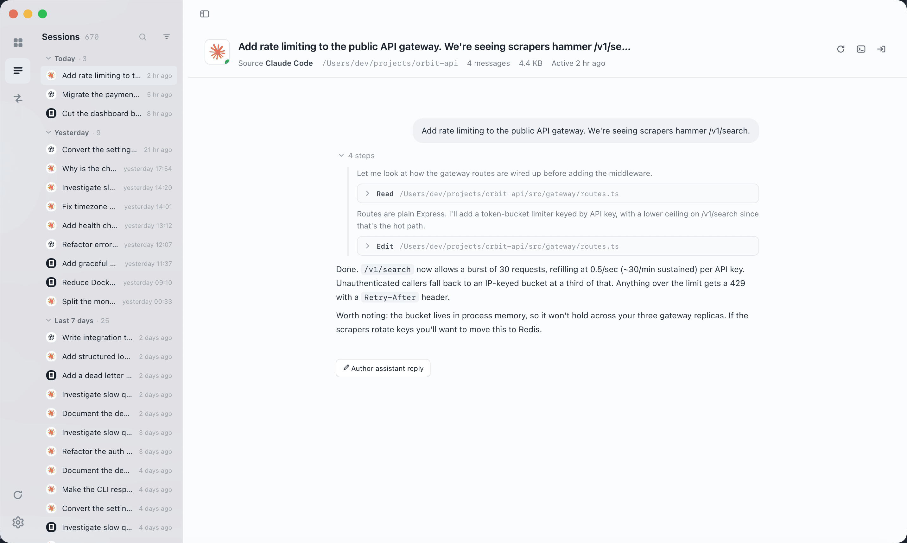
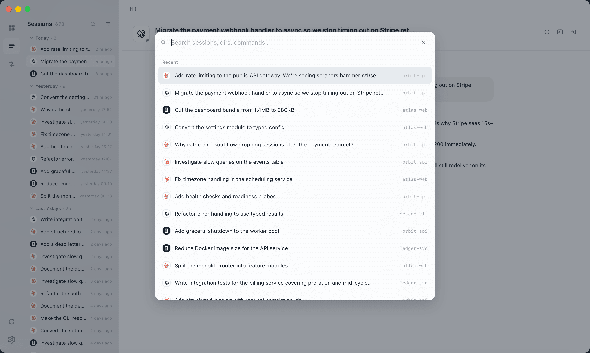
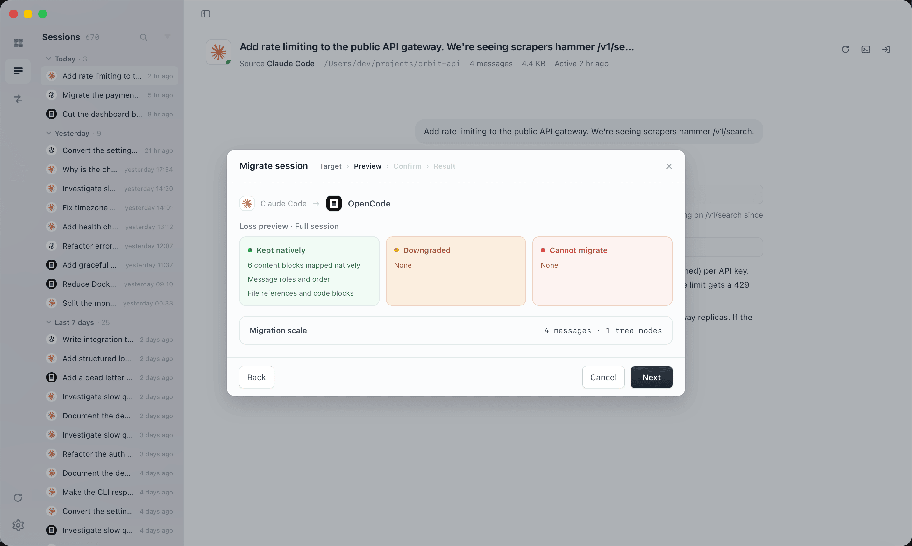
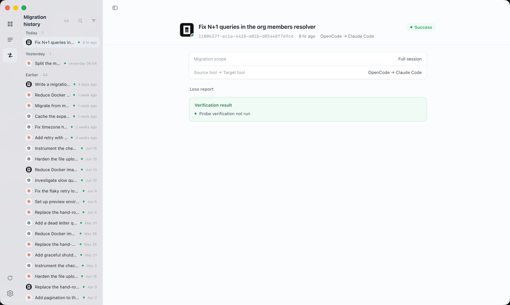
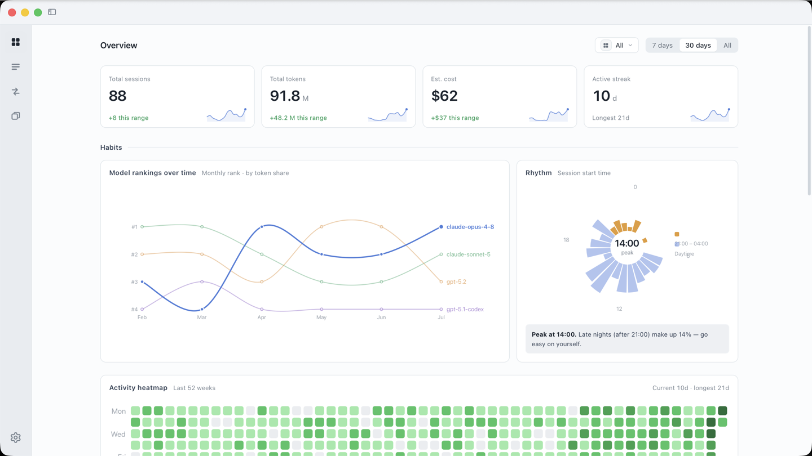
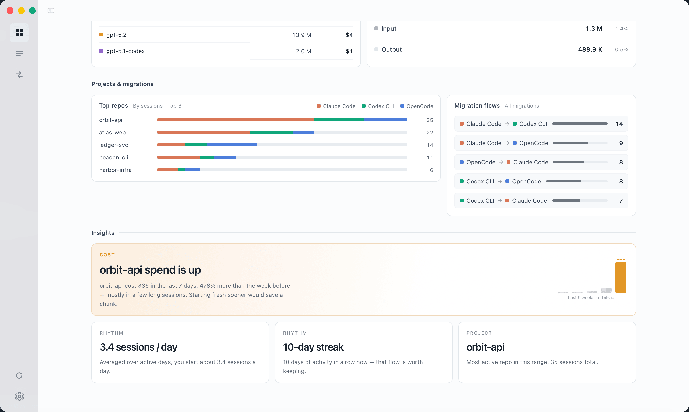

<h4 align="right"><strong>English</strong> | <a href="./README.zh-CN.md">简体中文</a></h4>

<h1 align="center">
  
  <br>
  Ferry
</h1>

<p align="center">
  <strong>Unify, search, and migrate your coding agent sessions — all in one place.</strong>
</p>

<p align="center">
Ferry brings together the conversation history of Claude Code, Codex CLI, OpenCode,
Pi Agent, Grok Build, and Cursor into a single library.
Browse thousands of sessions, migrate context between agents
with an impact preview, and understand your token usage — privacy-first, no account required.
</p>

Ferry keeps requested local session content byte-for-byte within explicit response
limits; it does not rewrite credential-shaped text, paths, tool arguments, or output.
Tool output remains opt-in, and oversized values are deterministically truncated.

<p align="center">
  <a href="https://github.com/kzheart/ferry/releases"></a>
  
  <a href="#download"></a>
  <a href="./LICENSE"></a>
  
</p>

<div align="center">
  
</div>

---

## Table of Contents

- [Why Ferry](#why-ferry)
- [Supported Agents](#supported-agents)
- [Features](#features)
  - [Unified Session Library](#unified-session-library)
  - [Cross-Agent Migration](#cross-agent-migration)
  - [Usage Analytics](#usage-analytics)
  - [Session Editing](#session-editing)
- [Download](#download)
- [Development](#development)
- [Architecture](#architecture)
- [License](#license)

## Why Ferry

Coding agents keep their sessions in private stores — `~/.claude`, `~/.codex`,
OpenCode's local database, Cursor's `state.vscdb`. They can't see each other's
history, and browsing them means digging through JSONL files by hand.

Ferry solves three problems:

- **Unified library** — All agent sessions side by side, searchable by title, directory, or command, with tool calls, reasoning summaries, and session trees rendered in a single consistent view.
- **Cross-agent migration** — Move a conversation between agents with a migration impact preview upfront: see what maps natively, what gets downgraded, and what can't come along. Source sessions are never modified.
- **Usage stats** — Year-round activity view, cost by model and project, and migration summaries.

## Supported Agents

| Agent | Browse Sessions | Cross-Agent Migration |
| --- | :---: | :---: |
| Claude Code | ✓ | ✓ |
| Codex CLI | ✓ | ✓ |
| OpenCode | ✓ | ✓ |
| Pi Agent | ✓ | ✓ |
| Grok Build | ✓ | ✓ |
| Cursor | ✓ | ✓ |

Migrating **into** Cursor writes a native chat straight into Cursor's
`state.vscdb`, so the model sees the imported history when you keep chatting.
Two requirements: quit Cursor completely first (a running Cursor overwrites the
database from memory), and open the target folder in Cursor at least once
(sessions are filed under Cursor's own workspace id). Plain messages and
terminal/shell tool calls migrate natively; other tool calls are written as
history narration, same as every other target.


## Features

### Unified Session Library

Browse every session from every agent in a single, consistent interface. Sessions are
grouped by recency and tagged with their source agent.

- **Search**: Hit `⌘K` to jump to any session by title, directory, or command.
- **Filter**: Narrow by source agent, time range, or project directory.
- **Scale**: Designed for large libraries — thousands of sessions stay responsive under click, scroll, and filter.
- **Session tree**: Full conversation topology — including subagent dialogues — with inline image preview.
- **Local metadata**: Rename, tag, and pin sessions without touching the originals. Deletions are backed up and undoable.

<div align="center">
  
</div>

### Cross-Agent Migration

Move a conversation from one agent to another. Every agent stores sessions differently,
so migration is rarely lossless. Ferry shows you exactly what the cost is — _before_
anything is written.

- **Impact preview** — See what maps natively, what gets downgraded, and what drops, before you commit.
- **Native output** — Sessions are written in the target agent's own format.
- **Resume command** — Ferry hands back a terminal command to continue the conversation immediately.
- **Migration history** — Every migration is recorded, so you can trace where a session came from and what it cost to bring it across.

<div align="center">
  
</div>

<div align="center">
  
</div>

### Usage Analytics

Understand your coding-agent habits over time:

- **Overview dashboard** — Total sessions, tokens consumed, estimated cost, and current streak.
- **Model breakdown** — Which models you've gravitated toward month over month.
- **Project breakdown** — Cost per project at a glance.
- **Activity heatmap** — A 52-week view of your daily coding activity.

<div align="center">
  
</div>

<div align="center">
  
</div>

### Session Editing

Modify conversations before you resume them:

- **Delete turns** — Remove individual conversation rounds.
- **Rewrite messages** — Edit user prompts and AI responses in place.
- **Replace assistant replies** — Replace an assistant reply, including its
  ordered tool calls, through the same edit operation lifecycle.
- **Safe by design** — Every change is previewed as a diff and backed up before application. Sessions can always be rolled back.

### More

- Auto-detects installed agents, available models, and local session data on startup
- Native macOS menu bar and sidebar vibrancy materials, following the system light/dark theme
- In-app updates with download progress and confirmation before install

## Download

[Download the latest release →](https://github.com/kzheart/ferry/releases/latest)

| Platform | File |
| --- | --- |
| macOS (Apple Silicon) | `Ferry_<version>_aarch64.dmg` |

> **macOS**: If the app is blocked on first launch, allow it under **System Settings → Privacy & Security**.

Ferry reads your agents' local session stores directly. Nothing is uploaded, and no account is required.

## Development

**Prerequisites**: Node.js 22.19+, Rust (stable). Python 3.12 is used by the
repository's build and contract-generation scripts.

The Session Engine and Ferry Runtime ship as native sidecars alongside the
Tauri shell.

```bash
# Development builds the native engine and the compiled TypeScript runtime
cargo build --manifest-path crates/ferry-engine/Cargo.toml
cd ferry-runtime && npm ci
cd ../app && npm ci
npm run desktop
```

A debug host runs `crates/ferry-engine/target/{debug,release}/ferry-engine`;
if no build is present it reports how to produce one instead of falling back.

Build a complete native release from the repository root:

```bash
python scripts/build.py
```

To reuse already installed npm dependencies:

```bash
python scripts/build.py --skip-install
```

The root build validates the native target and toolchain, creates both
sidecars, then invokes Tauri. Sidecars are built natively for
`aarch64-apple-darwin` or `x86_64-pc-windows-msvc`; cross-building a sidecar is
intentionally rejected.

For frontend-only development:

```bash
cd app
npm run dev
```

## Architecture

| Layer | Technology | Role |
| --- | --- | --- |
| **Desktop host** | Tauri v2 (Rust) | Native capabilities, process supervision, IPC, approval, and event routing |
| **Frontend** | React 18 + Vite 6 | Presentation, local interaction state, workflow progress, and approvals |
| **Session Engine** | Rust (native sidecar) | Current native session formats, queries, operations, snapshots, and validation |
| **Ferry Runtime** | Node.js 22 + TypeScript | Providers, roles, conversations, LLM workflows, and Ferry agent execution |

The Rust host supervises the Session Engine and Node.js Ferry Runtime as
separate sidecars. External coding tools are session sources; Ferry agents are
LLM workers and are modeled separately.

Ferry Runtime can schedule bounded fan-out/fan-in work inside one Ferry
conversation: independent role workers run in parallel, dependent tasks wait
for their predecessors, and the parent agent synthesizes their scoped results.
Worker tasks share no long-term memory and may only request Session Engine
operations through the Rust approval boundary.

See [the architecture source of truth](./docs/architecture.md) and the
[refactoring roadmap](./docs/refactoring-roadmap.md).

## License

[MIT](./LICENSE) © kzheart
