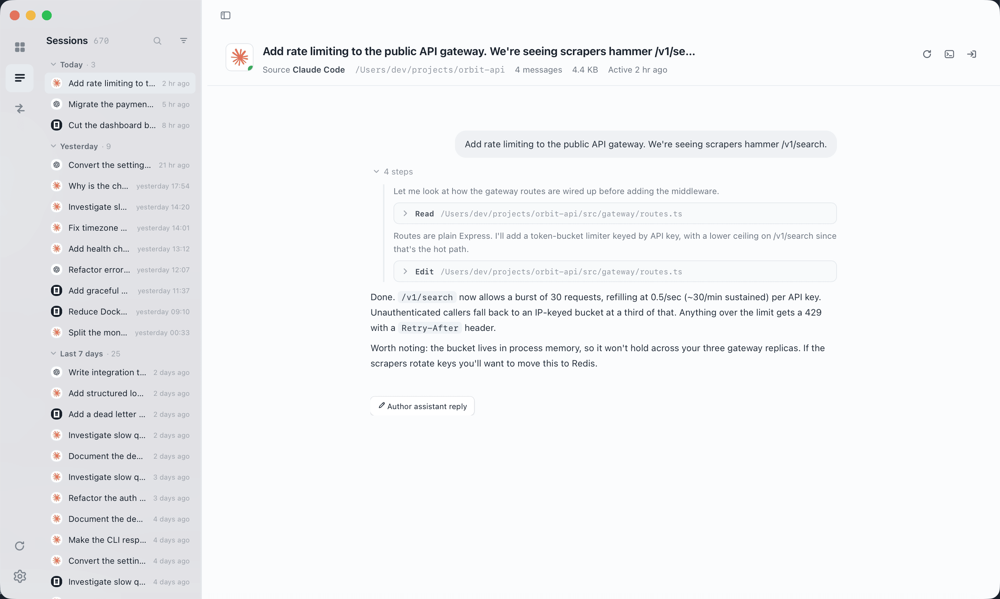
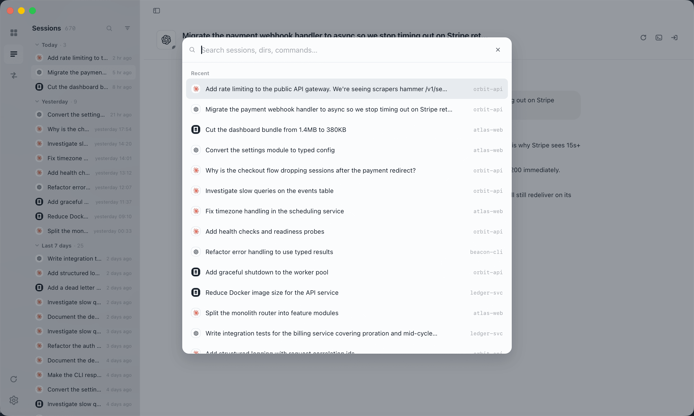
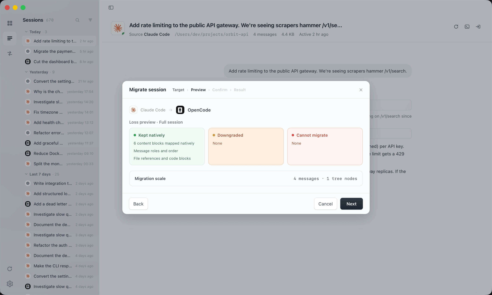
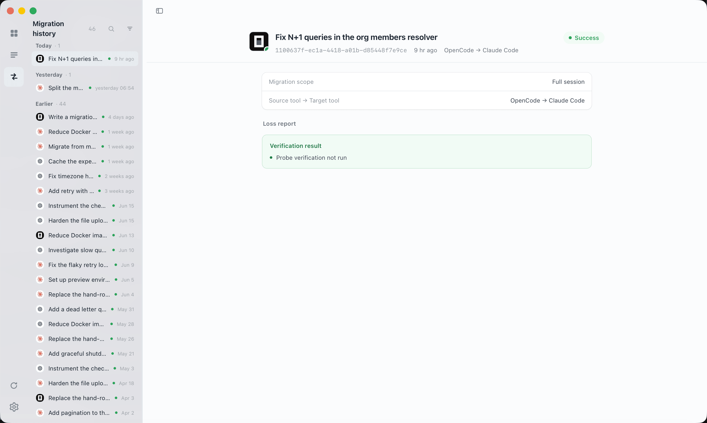
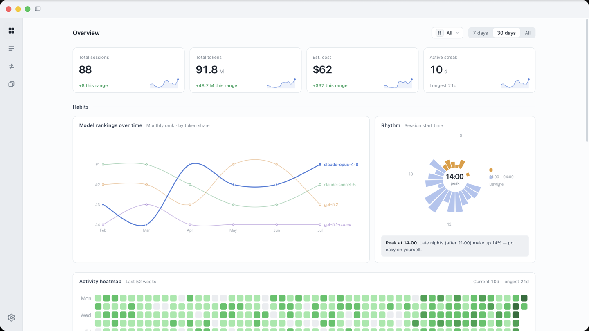
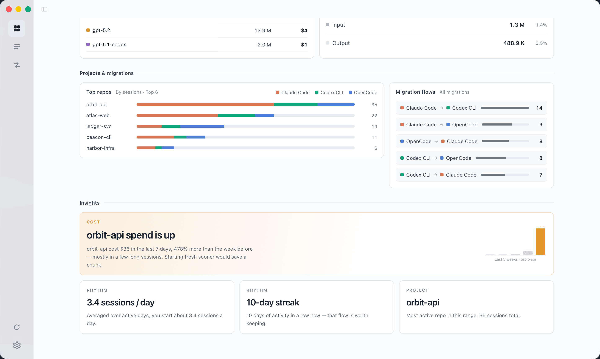

<h4 align="right"><a href="./README.md">English</a> | <strong>简体中文</strong></h4>

<h1 align="center">
  
  <br>
  Ferry
</h1>

<p align="center">
  <strong>统一管理、搜索、迁移你的 Coding Agent 会话 —— 都在一个地方。</strong>
</p>

<p align="center">
  Ferry 将 Claude Code、Codex CLI 和 OpenCode 的对话历史汇入同一个会话库。
  浏览上千条会话、跨 Agent 迁移上下文并预览数据损耗、掌握 Token 用量 ——
  隐私优先，无需注册账号。
</p>

<p align="center">
  <a href="https://github.com/kzheart/ferry/releases"></a>
  
  <a href="#下载"></a>
  <a href="./LICENSE"></a>
  
</p>

<div align="center">
  
</div>

---

## 目录

- [为什么需要 Ferry](#为什么需要-ferry)
- [支持的 Agent](#支持的-agent)
- [功能](#功能)
  - [统一会话库](#统一会话库)
  - [跨 Agent 迁移](#跨-agent-迁移)
  - [用量分析](#用量分析)
  - [会话编辑](#会话编辑)
- [下载](#下载)
- [开发](#开发)
- [架构](#架构)
- [许可证](#许可证)

## 为什么需要 Ferry

各个 Coding Agent 把会话锁在自己的私有存储里 —— `~/.claude`、`~/.codex`、
OpenCode 的本地数据库。它们彼此看不见对方的历史，想查看就得手动翻 JSONL 文件。

Ferry 解决三个问题：

- **统一会话库** —— 所有 Agent 的会话并排展示，可按标题、目录、命令搜索，工具调用、推理摘要、会话树在同一套界面里呈现。
- **跨 Agent 迁移** —— 在 Agent 之间搬运对话，迁移前先展示损耗：哪些原生保留、哪些会降级、哪些无法迁移。源会话全程只读。
- **用量洞察** —— 全年活跃度视图、按模型和项目拆分的成本、迁移方向汇总，自动生成洞察卡帮你发现值得注意的变化。

## 支持的 Agent

| Agent | 浏览会话 | 跨 Agent 迁移 |
| --- | :---: | :---: |
| Claude Code | ✓ | ✓ |
| Codex CLI | ✓ | ✓ |
| OpenCode | ✓ | ✓ |


## 功能

### 统一会话库

在一个统一的界面中浏览所有 Agent 的所有会话。会话按时间分组，标注来源 Agent。

- **搜索**：按 `⌘K`，通过标题、目录或命令跳转到任意会话。
- **筛选**：按来源 Agent、时间范围或项目目录缩小范围。
- **大规模**：为大会话库设计 —— 上千条会话的点击、滚动与筛选依然跟手。
- **会话树**：完整对话拓扑，包含子会话（subagent）对话，会话内图片可直接预览。
- **本地元数据**：重命名、打标签、置顶，不修改原始文件；删除自动备份，可随时撤销。

<div align="center">
  
</div>

### 跨 Agent 迁移

把一个会话从一个 Agent 迁移到另一个。各家 Agent 存储格式不同，迁移很难无损。
Ferry 会在你确认之前把代价摆出来 —— *在写入之前*。

- **损耗预览** —— 看清哪些原生保留、哪些降级、哪些丢失，再决定是否执行。
- **原生输出** —— 按目标 Agent 的原生格式写入会话。
- **接续命令** —— Ferry 会给出可直接粘贴到终端继续对话的命令。
- **迁移历史** —— 每次迁移都有记录，可追溯会话来源和迁移代价。

<div align="center">
  
</div>

<div align="center">
  
</div>

### 用量分析

长期追踪你的 Coding Agent 使用习惯：

- **总览仪表盘** —— 会话总数、Token 消耗、估算成本、连续活跃天数。
- **模型分布** —— 主力模型如何逐月变迁。
- **项目分布** —— 每个项目的成本，洞察卡自动标记值得注意的变化（如某个仓库花销突增、一段值得保持的连续记录）。
- **活跃热力图** —— 52 周的每日编码活跃度一览。

<div align="center">
  
</div>

<div align="center">
  
</div>

### 会话编辑

接续对话前先修改内容：

- **删除轮次** —— 移除单个对话轮次。
- **改写消息** —— 原地编辑用户提示词和 AI 回复。
- **补写回复** —— 撰写新的 AI 回复和工具调用。
- **安全设计** —— 每次修改以 diff 预览，应用前自动备份，会话随时可回滚。

### 更多

- 启动时自动检测已安装的 Agent、可用模型与本地会话数据
- 原生 macOS 菜单栏与侧边栏毛玻璃材质，跟随系统浅色/深色主题
- 应用内更新：显示下载进度，确认后再安装

## 下载

[下载最新版本 →](https://github.com/kzheart/ferry/releases/latest)

| 平台 | 文件 |
| --- | --- |
| macOS（Apple Silicon） | `Ferry_<version>_aarch64.dmg` |
| Windows（64 位） | `Ferry_<version>_x64-setup.exe` |

> **macOS**：首次打开若被系统拦截，在 **系统设置 → 隐私与安全性** 中允许运行即可。

Ferry 直接读取本机 Agent 的会话存储，不上传任何数据，也不需要注册账号。

## 开发

**环境要求**：Node.js 20+、Rust（stable）、Python 3.12

引擎以 PyInstaller sidecar 的形式与 Tauri 外壳一起分发。

```bash
# 1. 构建 Python 引擎 sidecar
python -m pip install -r requirements-build.txt
python scripts/build-sidecar.py --clean

# 2. 安装前端依赖并运行
cd app
npm ci
npm run tauri dev
```

打包正式版本：

```bash
cd app && npm run tauri build
```

> 引擎代码有改动时记得重新构建 sidecar —— `npm run tauri build` 只会打包已存在的二进制，不会替你重新构建。

## 架构

| 层 | 技术 | 职责 |
| --- | --- | --- |
| **Shell** | Tauri v2 (Rust) | 原生窗口、菜单栏、系统托盘、进程管理、应用内更新 |
| **前端** | React 18 + Vite 6 | 会话浏览、搜索、编辑、迁移界面 |
| **引擎** | Python 3.12 (PyInstaller sidecar) | 会话扫描、读写、迁移逻辑、用量分析 |

Tauri Shell 通过 stdin/stdout 上的 JSON-RPC 协议与 Python 引擎通信。
每个 Coding Agent 通过[插件接口](./engine/adapters/base/plugin.py)接入，
将各自的会话格式抽象为统一的规范模型。

## 许可证

[MIT](./LICENSE) © kzheart
